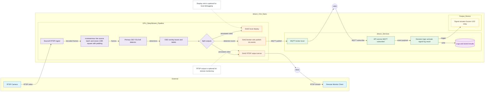

## Architecture Diagram

```mermaid
flowchart LR

  classDef net fill:#e1f5fe,stroke:#0288d1,stroke-width:1px,color:#0b2b3a;
  classDef gpu fill:#ede7f6,stroke:#5e35b1,stroke-width:1px,color:#231942;
  classDef svc fill:#e8f5e9,stroke:#2e7d32,stroke-width:1px,color:#1b4332;
  classDef sink fill:#fff3e0,stroke:#ef6c00,stroke-width:1px,color:#4e342e;
  classDef store fill:#f3e5f5,stroke:#8e24aa,stroke-width:1px,color:#3c096c;
  classDef hw fill:#fffde7,stroke:#f9a825,stroke-width:1px,color:#4e342e;
  classDef note fill:#ffffff,stroke:#90a4ae,stroke-width:1px,color:#263238;

  subgraph External
    CAM[RTSP Camera]
    MON[Remote Monitor Client]
  end

  subgraph Jetson_Orin_Nano
    subgraph GPU_DeepStream_Pipeline
      SRC[Source0 RTSP ingest]
      MUX[nvstreammux live source batch and resize 1280 square with padding]
      P1[Primary GIE YOLOv8 detector]
      OSD[OSD overlay boxes and labels]
      TEE{Split outputs}
      S0[Sink0 local display]
      S2[Sink2 RTSP output server]
      S3[Sink3 broker sink publish ds events]
    end

    subgraph Jetson_Services
      BRK[MQTT broker local]
      API[API service MQTT subscriber]
      CTRL[Decision logic activate signal log result]
      LOG[(Logs and stored results)]
    end

    subgraph Output_Device
      ACT[Signal actuator buzzer LED relay]
    end
  end

  P8554((8554))
  P1883((1883))

  CAM -->|RTSP video| SRC
  SRC -->|decoded frames| MUX -->|frames| P1 -->|detections| OSD --> TEE

  TEE -->|annotated video| S0
  TEE -->|annotated video| S2
  S2 --> P8554 -->|RTSP stream| MON

  TEE -->|detection event| S3
  S3 -->|MQTT publish| BRK
  BRK --> P1883 -->|MQTT subscribe| API

  API -->|event payload| CTRL
  CTRL -->|trigger| ACT
  CTRL -->|write| LOG

  NOTE1[RTSP output is optional for remote monitoring]:::note
  NOTE2[Display sink is optional for local debugging]:::note
  NOTE1 -.-> S2
  NOTE2 -.-> S0

  class CAM,MON net
  class SRC,MUX,P1,OSD,TEE gpu
  class S0,S2,S3 sink
  class BRK,API,CTRL svc
  class LOG store
  class ACT hw
```