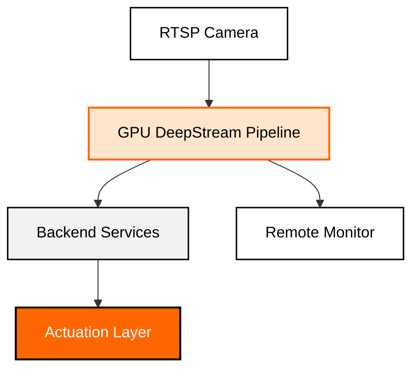
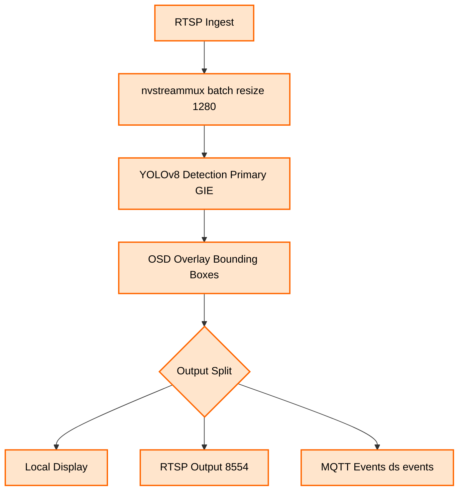
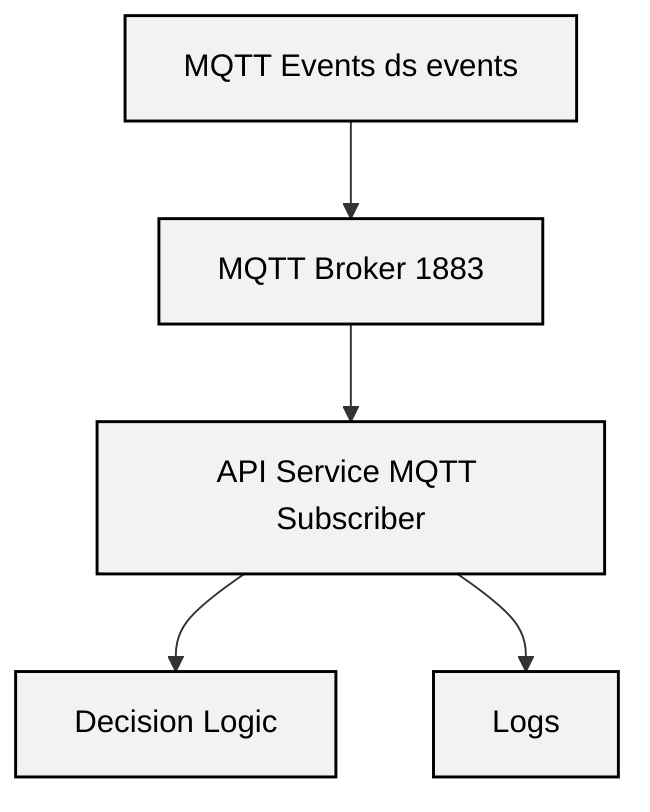
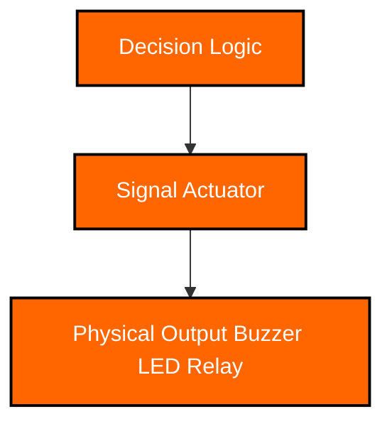

# Nilbye System Architecture

This document describes the system architecture of the Nilbye prototype device running on NVIDIA Jetson Orin Nano.

The system processes real-time RTSP video, performs YOLOv8-based object detection using NVIDIA DeepStream, publishes structured detection metadata via MQTT, and activates a signal actuator based on backend decision logic.

---

# High-Level Architecture

The diagram below shows the overall system structure.

---

## GPU DeepStream Pipeline

### Responsibilities

- Ingest RTSP video stream  
- Resize and batch frames for GPU inference  
- Run YOLOv8 object detection  
- Generate structured detection metadata  
- Render bounding boxes on output frames  
- Publish detection events to MQTT topic ds events  

---

## Backend Services

### Responsibilities

- Receive detection events from DeepStream  
- Parse structured payload data  
- Apply decision rules  
- Trigger actuation logic  
- Log results for monitoring and analysis  

---

## Actuation Layer

### Responsibilities

- Convert software decisions into physical signals  
- Activate deterrence mechanisms  
- Provide real-world system response  

---

## System Design Philosophy

The Nilbye architecture separates responsibilities into distinct layers:

- **Perception Layer** – Real-time GPU-based computer vision  
- **Communication Layer** – MQTT-based event distribution  
- **Decision Layer** – Backend rule evaluation  
- **Actuation Layer** – Physical system response  

This modular separation improves:

- Maintainability  
- Scalability  
- Debugging clarity  
- Deployment flexibility  

The entire system runs locally on the NVIDIA Jetson Orin Nano, enabling fully embedded, real-time operation.